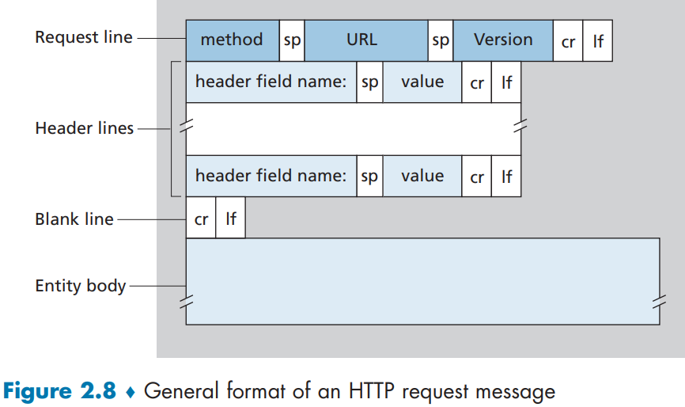
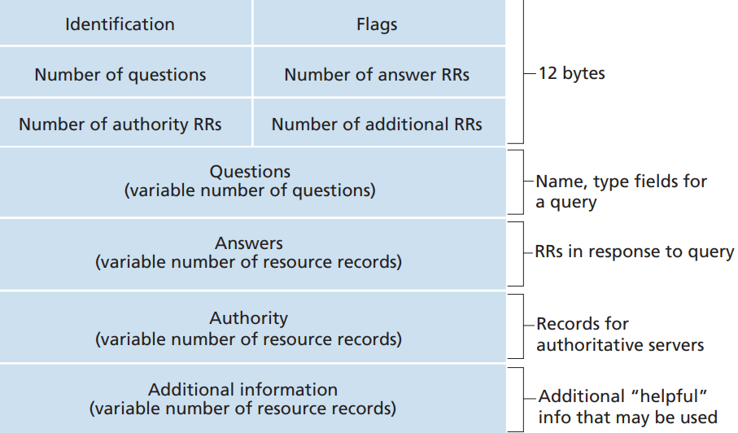

# 2 Application Layer
## 2.1 Principles of Network Applications
Communication for a network application takes place 
between end systems at the application layer.

### 2.1.1 Network Application Architectures
From the application developer’s perspective, the network architecture is fixed and provides a specific set of services to applications. The **application 
architecture**, on the other hand, is designed by the application developer and dictates how the application is structured over the various end systems.

In a **client-server** architecture, there is an always-on host, called the *server*, 
which services requests from many other hosts, called *clients*.

A **data center**, housing a large number of hosts, is often 
used to create a powerful virtual server for high-demand web applications.

In a **P2P architecture**, there is minimal (or no) reliance on dedicated servers in 
data centers. Instead the application exploits direct communication between pairs of 
intermittently connected hosts, called *peers*. The peers are not owned by the service 
provider, but are instead desktops and laptops controlled by users. One of the most compelling features of P2P architectures is their **self-scalability**. However, P2P applications face challenges of security, performance, and reliability due to their highly 
decentralized structure.

### 2.1.2 Processes Communicating
In the jargon of operating systems, it is not actually programs but **processes** that communicate. A process can be thought of as a program that is running within an end 
system.

Processes on two different end systems communicate with each other by 
exchanging **messages** across the computer network.

#### Client and Server Processes
A network application consists of pairs of processes that send messages to each 
other over a network. For each pair of 
communicating processes, we typically label one of the two processes as the **client**
and the other process as the **server**:
> In the context of a communication session between a pair of processes, the process that initiates the communication (that is, initially contacts the other process 
at the beginning of the session) is labeled as the client. The process that waits to 
be contacted to begin the session is the server.

#### The Interface Between the Process and the Computer Network
A process 
sends messages into, and receives messages from, the network through a software 
interface called a **socket**. It 
is also referred to as the **Application Programming Interface (API)** between the 
application and the network, since the socket is the programming interface with which 
network applications are built.

The application developer has control of everything on 
the application-layer side of the socket but has little control of the transport-layer side 
of the socket. The only control that the application developer has on the transportlayer side is (1) the choice of transport protocol and (2) perhaps the ability to fix a few transport-layer parameters such as maximum buffer and maximum segment sizes.

#### Addressing Processes
To identify the receiving process, two pieces of information need to be specified: 
(1) the address of the host and (2) an identifier that specifies the receiving process in 
the destination host.

In the Internet, the host is identified by its **IP address**. A destination **port number** identifies the receiving process (more specifically, the receiving socket) running in 
the host.

### 2.1.3 Transport Services Available to Applications
The application at the sending side pushes messages through the 
socket. At the other side of the socket, the transport-layer protocol has the responsibility of getting the messages to the socket of the receiving process. Factors to consider when choosing a transport-layer protocol: reliable data transfer, throughput, timing, and security.

#### Reliable Data Transfer
For some applications, e.g. online banking, the data sent by one end of the application must be delivered correctly and completely to the other end of the application. If a protocol provides such 
a guaranteed data delivery service, it is said to provide **reliable data transfer**.

When a transport-layer protocol doesn’t provide reliable data transfer, some of 
the data sent by the sending process may never arrive at the receiving process. This 
may be acceptable for **loss-tolerant applications**, e.g. conversational audio/video.

#### Throughput
Applications that have throughput requirements are 
said to be **bandwidth-sensitive applications**, e.g. multimedia applications. 

While bandwidth-sensitive applications have specific throughput requirements, 
**elastic applications** can make use of as much, or as little, throughput as happens to 
be available, e.g. email, file transfer.

#### Timing
Timing guarantees can come in many shapes and forms, e.g. delivery latency.

#### Security
A transport protocol can encrypt/decrypt all data 
transmitted, and/or provide other security services including data 
integrity and end-point authentication.

### 2.1.4 Transport Services Provided by the Internet
The Internet (and, more generally, TCP/
IP networks) makes two transport protocols available to applications, UDP and TCP.

#### TCP Services
The TCP service model includes a connection-oriented service and a reliable data 
transfer service. When an application invokes TCP as its transport protocol, the 
application receives both of these services from TCP.

- *Connection-oriented service.* TCP has the client and server exchange transportlayer control information with each other before the application-level messages begin to flow. This so-called handshaking procedure alerts the client 
and server, allowing them to prepare for an onslaught of packets. After the 
handshaking phase, a TCP connection is said to exist between the sockets 
of the two processes. The connection is a full-duplex connection in that the two 
processes can send messages to each other over the connection at the same time. 
When the application finishes sending messages, it must tear down the connection.
- Reliable data transfer service. The communicating processes can rely on TCP to 
deliver all data sent without error and in the proper order. When one side of the 
application passes a stream of bytes into a socket, it can count on TCP to deliver the 
same stream of bytes to the receiving socket, with no missing or duplicate bytes.

TCP also includes a congestion-control mechanism. The TCP congestion-control mechanism throttles a sending process (client or 
server) when the network is congested between sender and receiver. TCP congestion control also attempts to limit each TCP connection to 
its fair share of network bandwidth.

#### UDP Service
UDP is a no-frills, lightweight transport protocol, providing minimal services. UDP 
is connectionless, so there is no handshaking before the two processes start to communicate. UDP provides an unreliable data transfer service—that is, when a process 
sends a message into a UDP socket, UDP provides no guarantee that the message 
will ever reach the receiving process. Furthermore, messages that do arrive at the 
receiving process may arrive out of order.

UDP does not include a congestion-control mechanism, so the sending side of 
UDP can pump data into the layer below (the network layer) at any rate it pleases. 

#### Services Not Provided by Internet Transport Protocols
 In summary, today’s Internet can often provide satisfactory service to time-sensitive applications, but it cannot provide any timing or throughput guarantees.

### 2.1.5 Application-Layer Protocols
An **application-layer 
protocol** defines how an application’s processes, running on different end systems, 
pass messages to each other. In particular, an application-layer protocol defines:
- The types of messages exchanged, for example, request messages and response 
messages
- The syntax of the various message types, such as the fields in the message and 
how the fields are delineated
- The semantics of the fields, that is, the meaning of the information in the fields
- Rules for determining when and how a process sends messages and responds to 
messages

Some application-layer protocols are specified in RFCs and are therefore in the 
public domain, e.g. HTTP. Many other application-layer protocols are proprietary and intentionally not available in the public domain.

### 2.1.6 Network Applications Covered in This Book
In this chapter, we discuss five important applications: the Web, electronic mail, 
directory service, video streaming, and P2P applications.

## 2.2 The Web and HTTP
### 2.2.1 Overview of HTTP
The **HyperText Transfer Protocol (HTTP)**, the Web’s application-layer protocol, 
is at the heart of the Web. It is defined in [RFC 1945], [RFC 7230] and [RFC 7540]. 
HTTP is implemented in two programs: a client program and a server program. The 
client program and server program, executing on different end systems, talk to each 
other by exchanging HTTP messages. HTTP defines the structure of these messages 
and how the client and server exchange the messages.

A **Web page** (also called a document) consists of objects. An object is 
simply a file - such as an HTML file - —that is addressable by a single URL. Most Web 
pages consist of a **base HTML file** and several referenced objects. The base HTML file references the other objects in the page with the objects’ URLs. 

Each URL has two 
components: the hostname of the server that houses the object and the object’s 
path name. For example, the URL
```
http://www.someschool.edu/someDepartment/picture.gif
```
has `http://www.someschool.edu/`  for a hostname and `/someDepartment/picture.gif` for a path name. **Web browsers** implement the client side of HTTP. **Web servers**, which implement the server side 
of HTTP, house Web objects, each addressable by a URL.

HTTP uses TCP as its underlying transport protocol (rather than running on top 
of UDP). The HTTP client first initiates a TCP connection with the server. Once the 
connection is established, the browser and the server processes access TCP through 
their socket interfaces.

Because an HTTP server maintains no information about the clients, HTTP is said to be a **stateless protocol**.

A Web server is always on, with a fixed IP address, and it services 
requests from potentially millions of different browsers.

The original version of HTTP is called HTTP/1.0 and dates back to the early 
1990’s [RFC 1945]. As of 2020, the majority of HTTP transactions take place over 
HTTP/1.1 [RFC 7230]. However, increasingly browsers and Web servers also support a new version of HTTP called HTTP/2 [RFC 7540]. At the end of this section, 
we’ll provide an introduction to HTTP/2.

### 2.2.2 Non-Persistent and Persistent Connections
An application is said to use 
**non-persistent connections** if each request/response pair is sent over a separate TCP connection.

An application is said to use 
**persistent connections** if all of the requests and their corresponding responses are sent over the same TCP connection.

#### HTTP with Non-Persistent Connections
The steps of transferring a Web page from server to client for the 
case of non-persistent connections:
1. The HTTP client process initiates a TCP connection to the server `xxx.com` on port number 80, which is the default port number 
for HTTP. Associated with the TCP connection, there will be a socket at the 
client and a socket at the server.
2. The HTTP client sends an HTTP request message to the server via its socket. The request message includes the path name of the requested resource.
3. The HTTP server process receives the request message via its socket, retrieves 
the object  from its storage (RAM or 
disk), encapsulates the object in an HTTP response message, and sends the 
response message to the client via its socket.
4. The HTTP server process tells TCP to close the TCP connection. (But TCP 
doesn’t actually terminate the connection until it knows for sure that the client 
has received the response message intact.)
5. The HTTP client receives the response message. The TCP connection terminates.

The steps above illustrate the use of non-persistent connections, where each 
TCP connection is closed after the server sends the object—the connection does not 
persist for other objects. HTTP/1.0 employes non-persistent TCP connections.

The **round-trip time 
(RTT)** is the time it takes for a small packet to travel from client to server 
and then back to the client. The RTT includes packet-propagation delays, packet-queuing delays in intermediate routers and switches, and packet-processing delays.

Roughly, the total response time is two 
RTTs plus the transmission time at the server of the HTML file for requesting a web page (Initiate TCP connection - response - request file - response).

Short-comings: First, a brand-new connection 
must be established and maintained for each requested object. This can place a significant burden on the Web server. Second, each object suffers a delivery delay of two RTTs—one RTT to 
establish the TCP connection and one RTT to request and receive an object.

#### HTTP with Persistent Connections
With HTTP/1.1 persistent connections, the server leaves the TCP connection 
open after sending a response. Subsequent requests and responses between the same 
client and server can be sent over the same connection. In particular, an entire Web 
page (base HTML file plus other objects) can be sent over 
a single persistent TCP connection. Moreover, multiple Web pages residing on the 
same server can be sent from the server to the same client over a single persistent 
TCP connection. These requests for objects can be made back-to-back, without waiting for replies to pending requests (pipelining). Typically, the HTTP server closes 
a connection when it isn’t used for a certain time (a configurable timeout interval). The default mode of HTTP uses persistent connections with pipelining.

### 2.2.3 HTTP Message Format
The HTTP specifications [RFC 1945; RFC 7230; RFC 7540] include the definitions 
of the HTTP message formats. There are two types of HTTP messages, request messages and response messages, both of which are discussed below.

#### HTTP Request Message
Below we provide a typical HTTP request message:
```
GET /somedir/page.html HTTP/1.1
Host: www.someschool.edu
Connection: close
User-agent: Mozilla/5.0
Accept-language: fr
```
The first line of an HTTP request message is called the **request line**; the 
subsequent lines are called the **header lines**.
The request line has three fields: the 
method field, the URL field, and the HTTP version field. The method field can take 
on several different values, including `GET`, `POST`, `HEAD`, `PUT`, and `DELETE`.

The header line `Host:
www.someschool.edu` specifies the host on which the object resides. The host header line is required by Web proxy caches. By including the `Connection: 
close` header line, the browser is telling the server that it doesn’t want to bother 
with persistent connections; it wants the server to close the connection after sending 
the requested object. The `User-agent:` header line specifies the user agent, that 
is, the browser type that is making the request to the server. Here the user agent is 
Mozilla/5.0, a Firefox browser.

Below is the general format of a request message.


After the header lines (and the 
additional carriage return and line feed) there is an “entity body.”  The entity body is empty with the `GET` method, but is used with the `POST` method.

The `HEAD` method is similar to the GET method. When a server receives a 
request with the `HEAD` method, it responds with an HTTP message but it leaves out 
the requested object. Application developers often use the `HEAD` method for debugging.

#### HTTP Response Message
Below we provide a typical HTTP response message. This response message could 
be the response to the example request message just discussed.
```
HTTP/1.1 200 OK
Connection: close
Date: Tue, 18 Aug 2015 15:44:04 GMT
Server: Apache/2.2.3 (CentOS)
Last-Modified: Tue, 18 Aug 2015 15:11:03 GMT
Content-Length: 6821
Content-Type: text/html

(data data data data data ...)
```
It has three sections: an initial 
**status line**, six **header lines**, and then the **entity body**.

The status line has three fields: the protocol version 
field, a status code, and a corresponding status message.

The server uses the `Connection: close`
header line to tell the client that it is going to close the TCP connection after sending 
the message. The `Date:` header line indicates the time and date when the HTTP 
response was created and sent by the server. The `Server:` header line indicates that the message was generated by an Apache Web server; it is analogous to the `User-agent:` header line in 
the HTTP request message. The `Last-Modified:` header line indicates the time 
and date when the object was created or last modified. The 
`Content-Length:` header line indicates the number of bytes in the object being 
sent. The `Content-Type:` header line indicates that the object in the entity body 
is HTML text. (The object type is officially indicated by the Content-Type:
header and not by the file extension.)

The figure below shows the general format of a response 
message.


Check out HTTP response status codes: https://developer.mozilla.org/en-US/docs/Web/HTTP/Status

Try:
```
telnet gaia.cs.umass.edu 80
GET /kurose_ross/interactive/index.php HTTP/1.1
Host: gaia.cs.umass.edu
```
(Press the carriage return twice after typing the last line.) This opens a TCP connection to port 80 of the host `gaia.cs.umass.edu` and then sends the HTTP 
request message.

A browser will generate header lines as a function of the browser type and 
version, the user configuration of the browser and whether the browser currently 
has a cached, but possibly out-of-date, version of the object. Web servers behave 
similarly: There are different products, versions, and configurations, all of which 
influence which header lines are included in response messages.

### 2.2.4 User-Server Interaction: Cookies
**Cookies**, defined in [RFC 6265], allow sites to keep track of users.

Cookie technology has four components: (1) a cookie 
header line in the HTTP response message; (2) a cookie header line in the HTTP 
request message; (3) a cookie file kept on the user’s end system and managed by 
the user’s browser; and (4) a back-end database at the Web site.

The first 
time a user visits a site, the user can provide a user identification (possibly his or her 
name). During the subsequent sessions, the browser passes a cookie header to the 
server, thereby identifying the user to the server. Cookies can thus be used to create 
a user session layer on top of stateless HTTP.


Example: a user "Susan" accesses Amazon and eBay. When the request comes into the Amazon Web server, the server creates a unique 
identification number and creates an entry in its back-end database that is indexed 
by the identification number. The Amazon Web server then responds to Susan’s 
browser, including in the HTTP response a `Set-cookie:` header, which contains 
the identification number. The header line might be 
```
Set-cookie: 1678
```
If Susan returns to Amazon’s site, her browser will continue to put the header line `Cookie: 1678` in the request messages.

Although cookies often simplify the Internet shopping experience for the user, 
they are controversial because they can also be considered as an invasion of privacy. Using a combination of cookies and user-supplied account information, a Web site can learn a lot about a user and potentially sell this information to a 
third party.

### 2.2.5 Web Caching
A **Web cache**—also called a **proxy server**—is a network entity that satisfies HTTP 
requests on the behalf of an origin Web server.
The Web cache has its own disk 
storage and keeps copies of recently requested objects in this storage. A user’s browser can be configured so that all of the user’s HTTP requests 
are first directed to the Web cache [RFC 7234].  Once a browser is configured, each 
browser request for an object is first directed to the Web cache.

As an example, 
suppose a browser is requesting the object `http://www.someschool.edu/
campus.gif`. Here is what happens
1. The browser establishes a TCP connection to the Web cache and sends an HTTP 
request for the object to the Web cache.
2. The Web cache checks to see if it has a copy of the object stored locally. If it 
does, the Web cache returns the object within an HTTP response message to the 
client browser.
3. If the Web cache does not have the object, the Web cache opens a TCP connection to the origin server, that is, to `www.someschool.edu`. The Web cache then sends an HTTP request for the object into the cache-to-server TCP connection. After receiving this request, the origin server sends the object within an 
HTTP response to the Web cache.
4. When the Web cache receives the object, it stores a copy in its local storage and 
sends a copy, within an HTTP response message, to the client browser (over the 
existing TCP connection between the client browser and the Web cache).

Note that a cache is both a server and a client at the same time. When it receives 
requests from and sends responses to a browser, it is a server. When it sends requests 
to and receives responses from an origin server, it is a client.

Typically a Web cache is purchased and installed by an ISP. A major residential ISP (such as Comcast) might 
install one or more caches in its network and preconfigure its shipped browsers to 
point to the installed caches.

Web caching has seen deployment in the Internet for two reasons. First, a Web 
cache can substantially reduce the response time for a client request, particularly if 
the bottleneck bandwidth between the client and the origin server is much less than 
the bottleneck bandwidth between the client and the cache.  Second, Web caches can substantially reduce traffic on an institution’s access link to the Internet. By reducing 
traffic, the institution (for example, a company or a university) does not have to 
upgrade bandwidth as quickly, thereby reducing costs.

Through the use of **Content Distribution Networks (CDNs)**, Web caches are 
increasingly playing an important role in the Internet. A CDN company installs many 
geographically distributed caches throughout the Internet, thereby localizing much of 
the traffic. There are shared CDNs (such as Akamai and Limelight) and dedicated CDNs 
(such as Google and Netflix).

#### The Conditional GET
Although caching can reduce user-perceived response times, it introduces a new 
problem—the copy of an object residing in the cache may be stale. Fortunately, HTTP has a mechanism that allows a cache to 
verify that its objects are up to date. This mechanism is called the **conditional GET**
[RFC 7232]. An HTTP request message is a so-called conditional GET message if 
(1) the request message uses the `GET` method and (2) the request message includes an 
`If-Modified-Since:` header line.

- A user requests an object not in the Web cache
- The cache retrieves the object from the server, and also keeps the content of `Last-Modified:` header line in the response from the server
- Another user accesses the object
- The cache sends request for the object to the server, including a `If-modified-since:` header line, with content being the `Last-Modified:` content stored.
- The Web server could respond `304 Not Modified` with empty entity body.

### 2.2.6 HTTP/2
HTTP/2 [RFC 7540], standardized in 2015, was the first new version of HTTP since 
HTTP/1.1, which was standardized in 1997.

The primary goals for HTTP/2 are to reduce perceived latency by enabling request 
and response multiplexing over a single TCP connection, provide request prioritization 
and server push, and provide efficient compression of HTTP header fields. HTTP/2 
does not change HTTP methods, status codes, URLs, or header fields. Instead, HTTP/2 
changes how the data is formatted and transported between the client and server.

To motivate the need for HTTP/2, recall that HTTP/1.1 uses persistent TCP 
connections, allowing a Web page to be sent from server to client over a single TCP 
connection. However, sending all the objects in a Web page over a single TCP connection has a **Head of Line (HOL) blocking** problem. The problem: say, a web page has a large video clip at the top and many small objects below it, and suppose the transmission rate is low. Using a single TCP connection, the video clip 
will take a long time to pass through the bottleneck link, while the small objects are 
delayed as they wait behind the video clip; that is, the video clip at the head of the 
line blocks the small objects behind it. HTTP/1.1 browsers typically work around this 
problem by opening multiple parallel TCP connections, thereby having objects in the 
same web page sent in parallel to the browser. This way, the small objects can arrive 
at and be rendered in the browser much faster, thereby reducing user-perceived delay.

TCP congestion control, also provides browsers an unintended incentive to use multiple parallel TCP connections rather than a 
single persistent connection.
Very roughly speaking, TCP congestion control aims to 
give each TCP connection sharing a bottleneck link an equal share of the available 
bandwidth of that link; so if there are $n$ TCP connections operating over a bottleneck 
link, then each connection approximately gets $1/n$th of the bandwidth. By opening 
multiple parallel TCP connections to transport a single Web page, the browser can 
“cheat” and grab a larger portion of the link bandwidth. Many HTTP/1.1 browsers 
open up to six parallel TCP connections not only to circumvent HOL blocking but 
also to obtain more bandwidth.

One of the primary goals of HTTP/2 is to get rid of (or at least reduce the number of) parallel TCP connections for transporting a single Web page. This not only 
reduces the number of sockets that need to be open and maintained at servers, but 
also allows TCP congestion control to operate as intended. But with only one TCP 
connection to transport a Web page, HTTP/2 requires carefully designed mechanisms to avoid HOL blocking.

#### HTTP/2 Framing
The HTTP/2 solution for HOL blocking is to break each message into small frames, and 
interleave the request and response messages on the same TCP connection. Say, send 1 frame for each requested object at a time.

The ability to break down an HTTP message into independent frames, interleave them, and then reassemble them on the other end is the single most important 
enhancement of HTTP/2. The framing is done by the framing sub-layer of the 
HTTP/2 protocol. When a server wants to send an HTTP response, the response 
is processed by the framing sub-layer, where it is broken down into frames. The 
header field of the response becomes one frame, and the body of the message is 
broken down into one for more additional frames. The frames of the response are 
then interleaved by the framing sub-layer in the server with the frames of other 
responses and sent over the single persistent TCP connection. As the frames arrive 
at the client, they are first reassembled into the original response messages at the 
framing sub-layer and then processed by the browser as usual. Similarly, a client’s 
HTTP requests are broken into frames and interleaved

In addition to breaking down each HTTP message into independent frames, the 
framing sublayer also binary encodes the frames. Binary protocols are more efficient 
to parse, lead to slightly smaller frames, and are less error-prone.

#### Response Message Prioritization and Server Pushing
Message prioritization allows developers to customize the relative priority of 
requests to better optimize application performance.

When a client sends concurrent requests to a server, it can prioritize the 
responses it is requesting by assigning a weight between 1 and 256 to each message. The higher number indicates higher priority. Using these weights, the server can 
send first the frames for the responses with the highest priority. In addition to this, 
the client also states each message’s dependency on other messages by specifying 
the ID of the message on which it depends

Another feature of HTTP/2 is the ability for a server to send multiple responses 
for a single client request. That is, in addition to the response to the original request, 
the server can push additional objects to the client, without the client having to 
request each one. This is possible since the HTML base page indicates the objects 
that will be needed to fully render the Web page. So instead of waiting for the 
HTTP requests for these objects, the server can analyze the HTML page, identify 
the objects that are needed, and send them to the client before receiving explicit 
requests for these objects. Server push eliminates the extra latency due to waiting 
for the requests.

#### HTTP/3
QUIC, discussed in Chapter 3, is a new “transport” protocol that is implemented in 
the application layer over the bare-bones UDP protocol. QUIC has several features 
that are desirable for HTTP, such as message multiplexing (interleaving), per-stream 
flow control, and low-latency connection establishment. HTTP/3 is yet a new HTTP 
protocol that is designed to operate over QUIC. As of 2020, HTTP/3 is described 
in Internet drafts and has not yet been fully standardized. Many of the HTTP/2 features (such as message interleaving) are subsumed by QUIC, allowing for a simpler, 
streamlined design for HTTP/3.


## 2.3 Electronic Mail in the Internet
The Internet mail system has three major components: **user agents**, **mail servers**, and the 
**Simple Mail Transfer Protocol (SMTP)**.

User agents allow users to read, reply to, forward, save, and compose messages. E.g. Microsoft Outlook, Gmail.

When Alice is 
finished composing her message, her user agent sends the message to her mail server, 
where the message is placed in the mail server’s outgoing message queue. When Bob 
wants to read a message, his user agent retrieves the message from his mailbox in his 
mail server.

**Mail servers** form the core of the e-mail infrastructure. Each recipient, such 
as Bob, has a mailbox located in one of the mail servers. A typical message starts its 
journey in the sender’s user agent, then travels to the sender’s mail server, and then travels to the recipient’s mail server, where it is deposited in the recipient’s mailbox. 

Alice’s mail server 
must also deal with failures in Bob’s mail server. If Alice’s server cannot deliver 
mail to Bob’s server, Alice’s server holds the message in a **message queue** and 
attempts to transfer the message later. Reattempts are often done every 30 minutes 
or so; if there is no success after several days, the server removes the message and 
notifies the sender (Alice) with an e-mail message.

SMTP [RFC 5321] is the principal application-layer protocol for Internet electronic mail. It 
uses the reliable data transfer service of TCP to transfer mail from the sender’s mail 
server to the recipient’s mail server. As with most application-layer protocols, SMTP 
has two sides: a client side, which executes on the sender’s mail server, and a server 
side, which executes on the recipient’s mail server. Both the client and server sides of SMTP run on every mail server.

### 2.3.1 SMTP
SMTP is 
a legacy technology that possesses certain archaic characteristics. For example, it 
restricts the body (not just the headers) of all mail messages to simple 7-bit ASCII. It requires 
binary multimedia data to be encoded to ASCII before being sent over SMTP, and it 
requires the corresponding ASCII message to be decoded back to binary after SMTP 
transport.

To illustrate the basic operation of SMTP, let’s walk through a common scenario. Suppose Alice wants to send Bob a simple ASCII message.
1. Alice invokes her user agent for e-mail, provides Bob’s e-mail address (for 
example, `bob@someschool.edu`), composes a message, and instructs the 
user agent to send the message.
2. Alice’s user agent sends the message to her mail server, where it is placed in a 
message queue.
3. The client side of SMTP, running on Alice’s mail server, sees the message in the 
message queue. It opens a TCP connection to an SMTP server, running on Bob’s 
mail server.
4. After some initial SMTP handshaking, the SMTP client sends Alice’s message 
into the TCP connection.
5. At Bob’s mail server, the server side of SMTP receives the message. Bob’s mail 
server then places the message in Bob’s mailbox.
6. Bob invokes his user agent to read the message at his convenience.

It is important to observe that SMTP does not normally use intermediate mail servers for sending mail, even when the two mail servers are located at opposite ends of 
the world. If Alice’s server is in Hong Kong and Bob’s server is in St. Louis, the TCP 
connection is a direct connection between the Hong Kong and St. Louis servers. In particular, if Bob’s mail server is down, the message remains in Alice’s mail server and 
waits for a new attempt—the message does not get placed in some intermediate mail 
server.

Let’s next take a look at an example transcript of messages exchanged between an 
SMTP client (C) and an SMTP server (S). The hostname of the client is `crepes.fr`
and the hostname of the server is `hamburger.edu`. The ASCII text lines prefaced 
with C: are exactly the lines the client sends into its TCP socket, and the ASCII text 
lines prefaced with S: are exactly the lines the server sends into its TCP socket. The 
following transcript begins as soon as the TCP connection is established.

```
S:  220 hamburger.edu
C:  HELO crepes.fr
S:  250 Hello crepes.fr, pleased to meet you
C:  MAIL FROM: <alice@crepes.fr>
S:  250 alice@crepes.fr ... Sender ok
C:  RCPT TO: <bob@hamburger.edu>
S:  250 bob@hamburger.edu ... Recipient ok
C:  DATA
S:  354 Enter mail, end with ”.” on a line by itself
C:  Do you like ketchup?
C:  How about pickles?
C:  .
S:  250 Message accepted for delivery
C:  QUIT
S:  221 hamburger.edu closing connection
```

In the example above, the client sends a message (“`Do you like ketchup? 
How about pickles?`”) from mail server `crepes.fr` to mail server 
`hamburger.edu`. As part of the dialogue, the client issued five commands: 
`HELO` (an abbreviation for HELLO), `MAIL FROM`, `RCPT TO`, `DATA`, and `QUIT`. The client also sends a line consisting of a 
single period, which indicates the end of the message to the server. (In ASCII jargon, each message ends with `CRLF.CRLF`, where `CR` and `LF` stand for carriage 
return and line feed, respectively.)

SMTP uses persistent connections: If the sending 
mail server has several messages to send to the same receiving mail server, it can 
send all of the messages over the same TCP connection. For each message, the 
client begins the process with a new `MAIL FROM: crepes.fr`, designates the 
end of message with an isolated period, and issues `QUIT` only after all messages 
have been sent.

### 2.3.2 Mail Message Formats
When an e-mail message is sent from 
one person to another, a header containing peripheral information precedes the 
body of the message itself.

This peripheral information is contained in a series of 
header lines, which are defined in RFC 5322. The header lines and the body of the 
message are separated by a blank line (that is, by `CRLF`). RFC 5322 specifies the 
exact format for mail header lines as well as their semantic interpretations. As with 
HTTP, each header line contains readable text, consisting of a keyword followed 
by a colon followed by a value. Some of the keywords are required and others are 
optional. Every header must have a `From:` header line and a `To:` header line; 
a header may include a `Subject:` header line as well as other optional header 
lines. It is important to note that these header lines are different from the SMTP 
commands we studied in Section 2.3.1 (even though they contain some common 
words such as “from” and “to”). The commands in that section were part of the 
SMTP handshaking protocol; the header lines examined in this section are part of 
the mail message itself.

### 2.3.3 Mail Access Protocols
A typical 
user runs a user agent on the local host but accesses its mailbox stored on an always-on shared mail server. This mail server is shared with other users.

If Bob is using Web-based e-mail or a smartphone app (such as Gmail), then 
the user agent will use HTTP to retrieve Bob’s e-mail. This case requires Bob’s mail 
server to have an HTTP interface as well as an SMTP interface (to communicate with 
Alice’s mail server). The alternative method, typically used with mail clients such 
as Microsoft Outlook, is to use the **Internet Mail Access Protocol (IMAP)** defined 
in RFC 3501. Both the HTTP and IMAP approaches allow Bob to manage folders, 
maintained in Bob’s mail server. Bob can move messages into the folders he creates, 
delete messages, mark messages as important, and so on.

## 2.4 DNS—The Internet’s Directory Service
One 
identifier for a host is its **hostname**—such as `www.facebook.com`. Hosts are also identified by so-called **IP addresses**. 

An IP address consists of four bytes and has a 
rigid hierarchical structure. An IP address looks like 121.7.106.83, where each 
period separates one of the bytes expressed in decimal notation from 0 to 255. An IP 
address is hierarchical because as we scan the address from left to right, we obtain 
more and more specific information about where the host is located in the Internet 
(that is, within which network, in the network of networks).

### 2.4.1 Services Provided by DNS
People prefer the more mnemonic hostname identifier, while 
routers prefer fixed-length, hierarchically structured IP addresses. In order to reconcile these preferences, we need a directory service that translates hostnames to 
IP addresses. This is the main task of the Internet’s **domain name system (DNS)**. 

The DNS is (1) a distributed database implemented in a hierarchy of **DNS servers**, 
and (2) an application-layer protocol that allows hosts to query the distributed 
database. The DNS servers are often UNIX machines running the Berkeley Internet Name Domain (BIND) software [BIND 2020]. The DNS protocol runs over 
UDP and uses port 53.

NS is commonly employed by other application-layer protocols, including 
HTTP and SMTP, to translate user-supplied hostnames to IP addresses.

For example, in 
order for the user’s host to be able to send an HTTP request message to the Web server www.someschool.edu, the user’s host must first obtain the IP address of 
`www.someschool.edu`. This is done as follows.
1. The same user machine runs the client side of the DNS application.
2. The browser extracts the hostname, `www.someschool.edu`, from the URL 
and passes the hostname to the client side of the DNS application.
3. The DNS client sends a query containing the hostname to a DNS server.
4. The DNS client eventually receives a reply, which includes the IP address for 
the hostname.
5. Once the browser receives the IP address from DNS, it can initiate a TCP connection to the HTTP server process located at port 80 at that IP address.

We see from this example that DNS adds an additional delay—sometimes 
substantial—to the Internet applications that use it. Fortunately, as we discuss below, 
the desired IP address is often cached in a “nearby” DNS server, which helps to 
reduce DNS network traffic as well as the average DNS delay.

DNS provides a few other important services in addition to translating hostnames to IP addresses:
- **Host aliasing**. A host with a complicated hostname can have one or more 
alias names. For example, a hostname such as `relay1.west-coast
.enterprise.com` could have, say, two aliases such as `enterprise.com`
and `www.enterprise.com`. In this case, the hostname `relay1 
.west-coast.enterprise.com` is said to be a **canonical hostname**. Alias 
hostnames, when present, are typically more mnemonic than canonical hostnames. DNS can be invoked by an application to obtain the canonical hostname 
for a supplied alias hostname as well as the IP address of the host.
- **Mail server** aliasing. DNS can be invoked by a 
mail application to obtain the canonical hostname for a supplied alias hostname 
as well as the IP address of the host. In fact, the MX record (see below) permits a 
company’s mail server and Web server to have identical (aliased) hostnames; for 
example, a company’s Web server and mail server can both be called `enterprise.com`.
- oad distribution. DNS is also used to perform load distribution among replicated servers, such as replicated Web servers. Busy sites are 
replicated over multiple servers, with each server running on a different end system and each having a different IP address. For replicated Web servers, a set of IP ddresses is thus associated with one alias hostname. The DNS database contains 
this set of IP addresses. When clients make a DNS query for a name mapped to a 
set of addresses, the server responds with the entire set of IP addresses, but rotates 
the ordering of the addresses within each reply. Because a client typically sends 
its HTTP request message to the IP address that is listed first in the set, DNS rotation distributes the traffic among the replicated servers. DNS rotation is also used 
for e-mail so that multiple mail servers can have the same alias name.

The DNS is specified in RFC 1034 and RFC 1035, and updated in several additional RFCs. The interested reader is referred to these RFCs and the book by Albitz 
and Liu [Albitz 1993]; see also the retrospective paper [Mockapetris 1988], which 
provides a nice description of the what and why of DNS, and [Mockapetris 2005].

### 2.4.2 Overview of How DNS Works
Suppose that some application (such as a Web browser or a mail client) running 
in a user’s host needs to translate a hostname to an IP address. The application will 
invoke the client side of DNS, specifying the hostname that needs to be translated. 
(On many UNIX-based machines, `gethostbyname()` is the function call that 
an application calls in order to perform the translation.) DNS in the user’s host then takes over, sending a query message into the network. All DNS query and reply messages are sent within UDP datagrams to port 53. After a delay, ranging from milliseconds to seconds, DNS in the user’s host receives a DNS reply message that provides 
the desired mapping. This mapping is then passed to the invoking application. 

A simple design for DNS would have one DNS server that contains all the mappings. In this centralized design, clients simply direct all queries to the single DNS 
server, and the DNS server responds directly to the querying clients. Although the 
simplicity of this design is attractive, it is inappropriate for today’s Internet, with its 
vast (and growing) number of hosts. The problems with a centralized design include:
- **A single point of failure**. If the DNS server crashes, so does the entire Internet!
- **Traffic volume**. A single DNS server would have to handle all DNS queries (for 
all the HTTP requests and e-mail messages generated from hundreds of millions 
of hosts).
- **Distant centralized database**. A single DNS server cannot be “close to” all the 
querying clients. If we put the single DNS server in New York City, then all queries from Australia must travel to the other side of the globe, perhaps over slow 
and congested links. This can lead to significant delays.
- **Maintenance**. The single DNS server would have to keep records for all Internet 
hosts. Not only would this centralized database be huge, but it would have to be 
updated frequently to account for every new host.

Consequently, the DNS is distributed by design.

#### A Distributed, Hierarchical Database
In order to deal with the issue of scale, the DNS uses a large number of servers, 
organized in a hierarchical fashion and distributed around the world. No single DNS 
server has all of the mappings for all of the hosts in the Internet. Instead, the mappings are distributed across the DNS servers. To a first approximation, there are three 
classes of DNS servers—root DNS servers, top-level domain (TLD) DNS servers, 
and authoritative DNS servers.
- **Root DNS servers**. There are more than 1000 root servers instances scattered all 
over the world. These root servers are copies of 13 different root servers, managed by 12 different organizations, and coordinated 
through the Internet Assigned Numbers Authority [IANA 2020]. The full list 
of root name servers, along with the organizations that manage them and their 
IP addresses can be found at [Root Servers 2020]. Root name servers provide 
the IP addresses of the TLD servers
- **Top-level domain (TLD) servers**. For each of the top-level domains—top-level 
domains such as com, org, net, edu, and gov, and all of the country top-level 
domains such as uk, fr, ca, and jp—there is TLD server (or server cluster). The 
company Verisign Global Registry Services maintains the TLD servers for the 
com top-level domain, and the company Educause maintains the TLD servers for 
the edu top-level domain. The network infrastructure supporting a TLD can be 
large and complex; see [Osterweil 2012] for a nice overview of the Verisign network. See [TLD list 2020] for a list of all top-level domains. TLD servers provide 
the IP addresses for authoritative DNS servers
- **Authoritative DNS servers**. Every organization with publicly accessible hosts 
(such as Web servers and mail servers) on the Internet must provide publicly 
accessible DNS records that map the names of those hosts to IP addresses. An 
organization’s authoritative DNS server houses these DNS records. An organization can choose to implement its own authoritative DNS server to hold these 
records; alternatively, the organization can pay to have these records stored in an authoritative DNS server of some service provider. Most universities and large 
companies implement and maintain their own primary and secondary (backup) 
authoritative DNS server.

There is another important type of DNS 
server called the **local DNS server**. A local DNS server does not strictly belong to 
the hierarchy of servers but is nevertheless central to the DNS architecture. Each 
ISP—such as a residential ISP or an institutional ISP—has a local DNS server (also 
called a default name server). When a host makes a DNS query, the query is sent to the local DNS server, 
which acts a proxy, forwarding the query into the DNS server hierarchy.

#### DNS Caching
DNS extensively exploits DNS caching in order to 
improve the delay performance and to reduce the number of DNS messages 
ricocheting around the Internet. The idea behind DNS caching is very simple. In a 
query chain, when a DNS server receives a DNS reply (containing, for example, a 
mapping from a hostname to an IP address), it can cache the mapping in its local 
memory.

### 2.4.3 DNS Records and Messages
The DNS servers that together implement the DNS distributed database store 
**resource records (RRs)**, including RRs that provide hostname-to-IP address mappings. Each DNS reply message carries one or more resource records. In this and 
the following subsection, we provide a brief overview of DNS resource records and 
messages; more details can be found in [Albitz 1993] or in the DNS RFCs [RFC 
1034; RFC 1035].

A resource record is a four-tuple that contains the following fields:
```
(Name, Value, Type, TTL)
```
`TTL` is the time to live of the resource record; it determines when a resource should 
be removed from a cache.  The meaning of `Name` and `Value` depend on `Type`:
- If `Type=A`, then `Name` is a hostname and `Value` is the IP address for the hostname. Thus, a Type A record provides the standard hostname-to-IP address mapping. As an example, `(relay1.bar.foo.com, 145.37.93.126, A)` is 
a Type A record.
- If `Type=NS`, then `Name` is a domain (such as `foo.com`) and `Value` is the hostname of an authoritative DNS server that knows how to obtain the IP addresses 
for hosts in the domain. This record is used to route DNS queries further along in 
the query chain. As an example, `(foo.com, dns.foo.com, NS)` is a Type 
NS record.
- If `Type=CNAME`, then `Value` is a canonical hostname for the alias hostname 
`Name`. This record can provide querying hosts the canonical name for a hostname. As an example, `(foo.com, relay1.bar.foo.com, CNAME)` is a 
CNAME record.
- If `Type=MX`, then `Value` is the canonical name of a mail server that has an alias 
hostname `Name`. As an example, `(foo.com, mail.bar.foo.com, MX)`
is an MX record. Note that by using the MX record, a company can have the same aliased 
name for its mail server and for one of its other servers (such as its Web server). 
To obtain the canonical name for the mail server, a DNS client would query for 
an MX record; to obtain the canonical name for the other server, the DNS client 
would query for the CNAME record.

#### DNS Messages
DNS query and reply messages are the 
only two kinds of DNS messages. Furthermore, both query and reply messages have 
the same format, as shown in the following figure.



The semantics of the various fields in a 
DNS message are as follows:
- The first 12 bytes is the *header section*, which has a number of fields. The first 
field is a 16-bit number that identifies the query. This identifier is copied into the 
reply message to a query, allowing the client to match received replies with sent 
queries. There are a number of flags in the flag field. A 1-bit query/reply flag indicates whether the message is a query (0) or a reply (1). A 1-bit authoritative flag is 
set in a reply message when a DNS server is an authoritative server for a queried 
name. A 1-bit recursion-desired flag is set when a client (host or DNS server) 
desires that the DNS server perform recursion when it doesn’t have the record. A 
1-bit recursion-available field is set in a reply if the DNS server supports recursion. In the header, there are also four number-of fields. These fields indicate the 
number of occurrences of the four types of data sections that follow the header.
- The *question section* contains information about the query that is being made. 
This section includes (1) a name field that contains the name that is being queried, and (2) a type field that indicates the type of question being asked about the 
name—for example, a host address associated with a name (Type A) or the mail 
server for a name (Type MX).
- In a reply from a DNS server, the *answer section* contains the resource records for 
the name that was originally queried. A reply can 
return multiple RRs in the answer, since a hostname can have multiple IP addresses.
- The *authority section* contains records of other authoritative servers.
- The *additional section* contains other helpful records. For example, the answer 
field in a reply to an MX query contains a resource record providing the canonical hostname of a mail server. The additional section contains a Type A record 
providing the IP address for the canonical hostname of the mail server.

Sending a DNS query message directly from the host you’re 
working on to some DNS server can easily be done with the **nslookup program**.

#### Inserting Records into the DNS Database
The first thing to do when creating a website is to register the domain name at a registrar.
A registrar is a commercial entity that verifies the uniqueness of the domain name, enters 
the domain name into the DNS database, and collects a small fee 
from you for its services.

There are many registrars competing for customers, and the Internet Corporation for 
Assigned Names and Numbers (ICANN) accredits the various registrars. A complete 
list of accredited registrars is available at http://www.internic.net.

When you register the domain name with some registrar, you also need to provide the registrar with the names and IP addresses of 
your primary and secondary authoritative DNS servers. Suppose the names and IP 
addresses are dns1.networkutopia.com, dns2.networkutopia.com, 
212.2.212.1, and 212.212.212.2. For each of these two authoritative DNS servers, the registrar would then make sure that a Type NS and a Type A record are 
entered into the TLD com servers. Specifically, for the primary authoritative server 
for networkutopia.com, the registrar would insert the following two resource 
records into the DNS system:
```
(networkutopia.com, dns1.networkutopia.com, NS)
(dns1.networkutopia.com, 212.212.212.1, A)
```

(Until recently, the contents of each DNS server were configured statically, 
for example, from a configuration file created by a system manager. More recently, 
an UPDATE option has been added to the DNS protocol to allow data to be dynamically added or deleted from the database via DNS messages. [RFC 2136] and [RFC 
3007] specify DNS dynamic updates.)

Once all of these steps are completed, people will be able to visit your Web site 
and send e-mail to the employees at your company.
Suppose Alice in Australia wants to view the Web 
page www.networkutopia.com. As discussed earlier, her host will first send a 
DNS query to her local DNS server. The local DNS server will then contact a TLD 
com server. (The local DNS server will also have to contact a root DNS server if the 
address of a TLD com server is not cached.) This TLD server contains the Type NS 
and Type A resource records listed above, because the registrar had these resource 
records inserted into all of the TLD com servers. The TLD com server sends a reply 
to Alice’s local DNS server, with the reply containing the two resource records. The 
local DNS server then sends a DNS query to 212.212.212.1, asking for the Type 
A record corresponding to www.networkutopia.com. This record provides the 
IP address of the desired Web server, say, 212.212.71.4, which the local DNS 
server passes back to Alice’s host. Alice’s browser can now initiate a TCP connection to the host 212.212.71.4 and send an HTTP request over the connection.

## 2.5 Peer-to-Peer File Distribution
In P2P file distribution, 
each peer can redistribute any portion of the file it has received to any other peers, 
thereby assisting the server in the distribution process. As of 2020, the most popular 
P2P file distribution protocol is BitTorrent. Originally developed by Bram Cohen, 
there are now many different independent BitTorrent clients conforming to the BitTorrent protocol, just as there are a number of Web browser clients that conform to 
the HTTP protocol.

#### Scalability of P2P Architectures
The **distribution time** is the time it 
takes to get a copy of the file to all $N$ peers. For the client-server architecture, the distribution time increases linearly with the number of 
peers $N$.

Applications with the P2P architecture can be 
self-scaling. This scalability is a direct consequence of peers being redistributors as 
well as consumers of bits.

#### BitTorrent
BitTorrent is a popular P2P protocol for file distribution [Chao 2011]. In BitTorrent 
lingo, the collection of all peers participating in the distribution of a particular file is 
called a *torrent*. Peers in a torrent download equal-size *chunks* of the file from one 
another, with a typical chunk size of 256 KBytes. When a peer first joins a torrent, it 
has no chunks. Over time it accumulates more and more chunks. While it downloads 
chunks it also uploads chunks to other peers. Once a peer has acquired the entire 
file, it may (selfishly) leave the torrent, or (altruistically) remain in the torrent and 
continue to upload chunks to other peers.

Each torrent has an infrastructure node called a *tracker*. 
When a peer joins a torrent, it registers itself with the tracker and periodically informs 
the tracker that it is still in the torrent. In this manner, the tracker keeps track of the 
peers that are participating in the torrent. A given torrent may have fewer than ten or 
more than a thousand peers participating at any instant of time.

When a new peer, Alice, joins the torrent, the tracker 
randomly selects a subset of peers (for concreteness, say 50) from the set of participating peers, and sends the IP addresses of these 50 peers to Alice. Possessing this 
list of peers, Alice attempts to establish concurrent TCP connections with all the 
peers on this list. As time evolves, 
some of these peers may leave and other peers (outside the initial 50) may attempt to 
establish TCP connections with Alice. So a peer’s neighboring peers will fluctuate 
over time.

At any given time, each peer will have a subset of chunks from the file, with different peers having different subsets. Periodically, Alice will ask each of her neighboring peers (over the TCP connections) for the list of the chunks they have. If Alice 
has L different neighbors, she will obtain L lists of chunks. With this knowledge, 
Alice will issue requests (again over the TCP connections) for chunks she currently 
does not have.

In 
deciding which chunks to request, Alice uses a technique called **rarest first**. The 
idea is to determine, from among the chunks she does not have, the chunks that are 
the rarest among her neighbors (that is, the chunks that have the fewest repeated copies among her neighbors) and then request those rarest chunks first. In this manner, 
the rarest chunks get more quickly redistributed, aiming to (roughly) equalize the 
numbers of copies of each chunk in the torrent.

To determine which requests she responds to, BitTorrent uses a clever trading 
algorithm. The basic idea is that Alice gives priority to the neighbors that are currently supplying her data *at the highest rate*. Specifically, for each of her neighbors, 
Alice continually measures the rate at which she receives bits and determines the four 
peers that are feeding her bits at the highest rate. She then reciprocates by sending 
chunks to these same four peers. Every 10 seconds, she recalculates the rates and possibly modifies the set of four peers. In BitTorrent lingo, these four peers are said to be 
**unchoked**. Importantly, every 30 seconds, she also picks one additional neighbor at 
random and sends it chunks. Let’s call the randomly chosen peer Bob. In BitTorrent 
lingo, Bob is said to be **optimistically unchoked**. Because Alice is sending data to 
Bob, she may become one of Bob’s top four uploaders, in which case Bob would start 
to send data to Alice. If the rate at which Bob sends data to Alice is high enough, Bob 
could then, in turn, become one of Alice’s top four uploaders. The effect is that peers capable of uploading at compatible 
rates tend to find each other. The random neighbor selection also allows new peers 
to get chunks, so that they can have something to trade. All other neighboring peers 
besides these five peers (four “top” peers and one probing peer) are “choked,” that 
is, they do not receive any chunks from Alice. 

BitTorrent has a number of interesting 
mechanisms that are not discussed here, including pieces (mini-chunks), pipelining, 
random first selection, endgame mode, and anti-snubbing [Cohen 2003].

The incentive mechanism for trading just described is often referred to as tit-for-tat [Cohen 2003]. It has been shown that this incentive scheme can be circumvented 
[Liogkas 2006; Locher 2006; Piatek 2008]. Nevertheless, the BitTorrent ecosystem 
is wildly successful, with millions of simultaneous peers actively sharing files in hundreds of thousands of torrents.

We close our discussion on P2P by briefly mentioning another application of P2P, 
namely, Distributed Hast Table (DHT). A distributed hash table is a simple database, 
with the database records being distributed over the peers in a P2P system. DHTs have 
been widely implemented (e.g., in BitTorrent) and have been the subject of extensive 
research.

## 2.6 Video Streaming and Content Distribution Networks
By many estimates, streaming video—including Netflix, YouTube and Amazon 
Prime—account for about 80% of Internet traffic in 2020 [Cisco 2020].

### 2.6.1 Internet Video
In streaming stored video applications, the underlying medium is prerecorded video. These prerecorded videos are placed on servers, and users send requests to the servers to view 
the videos on demand. Many Internet companies today provide streaming video, 
including, Netflix, YouTube (Google), Amazon, and TikTok.

A video is a sequence of images, typically being displayed at a constant rate, for example, at 24 or 30 images per second. 
An uncompressed, digitally encoded image consists of an array of pixels, with each 
pixel encoded into a number of bits to represent luminance and color. An important 
characteristic of video is that it can be compressed, thereby trading off video quality 
with bit rate. Today’s off-the-shelf compression algorithms can compress a video to 
essentially any bit rate desired.

From a networking perspective, perhaps the most salient characteristic of video 
is its high bit rate. Compressed Internet video typically ranges from 100 kbps for 
low-quality video to over 4 Mbps for streaming high-definition movies; 4K streaming envisions a bitrate of more than 10 Mbps. This can translate to huge amount of 
traffic and storage, particularly for high-end video.

By far, the most important performance measure for streaming video is average endto-end throughput. In order to provide continuous playout, the network must provide 
an average throughput to the streaming application that is at least as large as the bit 
rate of the compressed video.

### 2.6.2 HTTP Streaming and DASH
In HTTP streaming, the video is simply stored at an HTTP server as an ordinary 
file with a specific URL. When a user wants to see the video, the client establishes 
a TCP connection with the server and issues an HTTP `GET` request for that URL. The server then sends the video file, within an HTTP response message, as quickly 
as the underlying network protocols and traffic conditions will allow. On the client 
side, the bytes are collected in a client application buffer. Once the number of bytes 
in this buffer exceeds a predetermined threshold, the client application begins playback—specifically, the streaming video application periodically grabs video frames 
from the client application buffer, decompresses the frames, and displays them on 
the user’s screen. Thus, the video streaming application is displaying video as it is 
receiving and buffering frames corresponding to latter parts of the video.

Major shortcoming of HTTP streaming: All clients receive the same encoding of the video, despite the 
large variations in the amount of bandwidth available to a client, both across different 
clients and also over time for the same client. This has led to the development of a new 
type of HTTP-based streaming, often referred to as **Dynamic Adaptive Streaming 
over HTTP (DASH)**.

 In DASH, the video is encoded into several different versions, 
with each version having a different bit rate and, correspondingly, a different quality 
level. The client dynamically requests chunks of video segments of a few seconds in 
length. When the amount of available bandwidth is high, the client naturally selects 
chunks from a high-rate version; and when the available bandwidth is low, it naturally 
selects from a low-rate version. The client selects different chunks one at a time with 
HTTP GET request messages [Akhshabi 2011].

DASH allows clients with different Internet access rates to stream in video at 
different encoding rates. DASH also allows a client to adapt to the available bandwidth 
if the available end-to-end bandwidth changes during the session.

With DASH, each video version is stored in the HTTP server, each with a different URL. The HTTP server also has a **manifest file**, which provides a URL for each 
version along with its bit rate. The client first requests the manifest file and learns 
about the various versions. The client then selects one chunk at a time by specifying a 
URL and a byte range in an HTTP GET request message for each chunk. While downloading chunks, the client also measures the received bandwidth and runs a rate determination algorithm to select the chunk to request next

### 2.6.3 Content Distribution Networks
In order to meet the challenge of distributing massive amounts of video data 
to users distributed around the world, almost all major video-streaming companies 
make use of **Content Distribution Networks (CDNs)**. A CDN manages servers in multiple geographically distributed locations, stores copies of the videos (and other 
types of Web content, including documents, images, and audio) in its servers, and 
attempts to direct each user request to a CDN location that will provide the best user 
experience. The CDN may be a **private CDN**, that is, owned by the content provider 
itself; for example, Google’s CDN distributes YouTube videos and other types of 
content. The CDN may alternatively be a **third-party CDN** that distributes content 
on behalf of multiple content providers; Akamai, Limelight and Level-3 all operate 
third-party CDNs. A very readable overview of modern CDNs is [Leighton 2009; 
Nygren 2010].

CDNs typically adopt one of two different server placement philosophies:
- **Enter Deep**. One philosophy, pioneered by Akamai, is to *enter deep* into the 
access networks of Internet Service Providers, by deploying server clusters in 
access ISPs all over the world. Akamai takes this approach with clusters in thousands of locations. The goal is 
to get close to end users, thereby improving user-perceived delay and throughput 
by decreasing the number of links and routers between the end user and the CDN 
server from which it receives content. Because of this highly distributed design, 
the task of maintaining and managing the clusters becomes challenging.
- **Bring Home**. A second design philosophy, taken by Limelight and many 
other CDN companies, is to *bring the ISPs home* by building large clusters 
at a smaller number (for example, tens) of sites. Instead of getting inside the 
access ISPs, these CDNs typically place their clusters in Internet Exchange 
Points (IXPs). Compared with the enter-deep design philosophy, the bring-home design typically results in lower maintenance and 
management overhead, possibly at the expense of higher delay and lower 
throughput to end users.

Once its clusters are in place, the CDN replicates content across its clusters.Many CDNs do not 
push videos to their clusters but instead use a simple pull strategy: If a client requests 
a video from a cluster that is not storing the video, then the cluster retrieves the 
video (from a central repository or from another cluster) and stores a copy locally 
while streaming the video to the client at the same time. Similar to Web caching, when a cluster’s storage becomes full, it removes videos that are not 
frequently requested.

#### CDN Operation
When a browser in a user’s host is instructed to retrieve a specific video (identified by a URL), the CDN must 
intercept the request so that it can (1) determine a suitable CDN server cluster for that 
client at that time, and (2) redirect the client’s request to a server in that cluster.

Most CDNs take advantage of DNS to intercept and redirect requests. Suppose a content provider, 
NetCinema, employs the third-party CDN company, KingCDN, to distribute its videos to its customers. On the NetCinema Web pages, each of its videos is assigned a 
URL that includes the string “video” and a unique identifier for the video itself; for 
example, Transformers 7 might be assigned http://video.netcinema.com/6Y7B23V. 
Six steps then occur:
1. The user visits the Web page at NetCinema.
2. When the user clicks on the link http://video.netcinema.com/6Y7B23V, the 
user’s host sends a DNS query for video.netcinema.com.
3. The user’s Local DNS Server (LDNS) relays the DNS query to an authoritative 
DNS server for NetCinema, which observes the string “video” in the hostname video.netcinema.com. To “hand over” the DNS query to KingCDN, 
instead of returning an IP address, the NetCinema authoritative DNS server 
returns to the LDNS a hostname in the KingCDN’s domain, for example, 
a1105.kingcdn.com.
4. From this point on, the DNS query enters into KingCDN’s private DNS infrastructure. The user’s LDNS then sends a second query, now for a1105.kingcdn.
com, and KingCDN’s DNS system eventually returns the IP addresses of a 
KingCDN content server to the LDNS. It is thus here, within the KingCDN’s 
DNS system, that the CDN server from which the client will receive its content 
is specified.
5. The LDNS forwards the IP address of the content-serving CDN node to the 
user’s host.
6. Once the client receives the IP address for a KingCDN content server, it establishes a direct TCP connection with the server at that IP address and issues an 
HTTP GET request for the video. If DASH is used, the server will first send to 
the client a manifest file with a list of URLs, one for each version of the video, 
and the client will dynamically select chunks from the different versions

#### Cluster Selection Strategies
At the core of any CDN deployment is a **cluster selection strategy**, that is, a mechanism for dynamically directing clients to a server cluster or a data center within the 
CDN. As we just saw, the CDN learns the IP address of the client’s LDNS server 
via the client’s DNS lookup. After learning this IP address, the CDN needs to select 
an appropriate cluster based on this IP address. CDNs generally employ proprietary 
cluster selection strategies.

One simple strategy is to assign the client to the cluster that is **geographically closest**. Using commercial geo-location databases (such as Quova [Quova 2020] and MaxMind [MaxMind 2020]), each LDNS IP address is mapped to a geographic location. When a DNS request is received from a particular LDNS, the CDN chooses the geographically closest cluster, that is, the cluster that is the fewest kilometers from the LDNS 
“as the bird flies.” 

In order to determine the best cluster for a client based on the current traffic 
conditions, CDNs can instead perform periodic **real-time measurements** of delay 
and loss performance between their clusters and clients. For instance, a CDN can 
have each of its clusters periodically send probes (for example, ping messages or 
DNS queries) to all of the LDNSs around the world. One drawback of this approach 
is that many LDNSs are configured to not respond to such probes.

### 2.6.4 Case Studies: Netflix and YouTube
Skipped.

## 2.7 Socket Programming: Creating Network Applications
There are two types of network applications. One type is an implementation 
whose operation is specified in a protocol standard, such as an RFC or some other 
standards document; such an application is sometimes referred to as “open,” since 
the rules specifying its operation are known to all.

The other type of network application is a proprietary network application. In 
this case, the client and server programs employ an application-layer protocol that has 
not been openly published in an RFC or elsewhere.

When a client or server program implements a protocol defined by an RFC, it should use the well-known port number associated with the 
protocol; conversely, when developing a proprietary application, the developer must 
be careful to avoid using such well-known port numbers.

### 2.7.1 Socket Programming with UDP
When a socket is created, 
an identifier, called a **port number**, is assigned to it.

The sending process attaches to the packet a destination address, which consists of the destination host’s IP address and the destination socket’s port number.

Moreover, the sender’s source address—consisting of the IP address of the source host and the port number of the source socket—are also 
attached to the packet. However, attaching the source address to the packet is typically not done by the UDP application code; instead it is automatically done by the 
underlying operating system.

A simple program client-server application:
```
1. The client reads a line of characters (data) from its keyboard and sends the data 
to the server.
1. The server receives the data and converts the characters to uppercase.
2. The server sends the modified data to the client.
3. The client receives the modified data and displays the line on its screen.
```

#### UDPClient.py
```
from socket import *
serverName = 'hostname'
serverPort = 12000
clientSocket = socket(AF_INET, SOCK_DGRAM)
message = input('Input lowercase sentence:')
clientSocket.sendto(message.encode(),(serverName, serverPort))
modifiedMessage, serverAddress = clientSocket.recvfrom(2048)
print(modifiedMessage.decode())
clientSocket.close()
```

#### UDPServer.py
```
from socket import *
serverPort = 12000
serverSocket = socket(AF_INET, SOCK_DGRAM)
serverSocket.bind(('', serverPort))
print(”The server is ready to receive”)
while True:
 message, clientAddress = serverSocket.recvfrom(2048)
 modifiedMessage = message.decode().upper()
 serverSocket.sendto(modifiedMessage.encode(), 
clientAddress)
```

### 2.7.2 Socket Programming with TCP
Before the client and server can start to send data to each other, they first need to handshake and 
establish a TCP connection. One end of the TCP connection is attached to the client 
socket and the other end is attached to a server socket. When creating the TCP connection, we associate with it the client socket address (IP address and port number) 
and the server socket address (IP address and port number). With the TCP connection established, when one side wants to send data to the other side, it just drops the data into the TCP connection via its socket.

The server program 
must have a special socket that welcomes some 
initial contact from a client process running on an arbitrary host.

When the 
client creates its TCP socket, it specifies the address of the welcoming socket in the 
server, namely, the IP address of the server host and the port number of the socket. 
After creating its socket, the client initiates a three-way handshake and establishes a 
TCP connection with the server. The three-way handshake, which takes place within 
the transport layer, is completely invisible to the client and server programs.

During the three-way handshake, the server creates a new socket that is dedicated to that particular client.

#### TCPClient.py
```
from socket import *
serverName = 'servername'
serverPort = 12000
clientSocket = socket(AF_INET, SOCK_STREAM)
clientSocket.connect((serverName,serverPort))
sentence = input('Input lowercase sentence:')
clientSocket.send(sentence.encode())
modifiedSentence = clientSocket.recv(1024)
print('From Server: ', modifiedSentence.decode())
clientSocket.close()
```

#### TCPServer.py
```
from socket import *
serverPort = 12000
serverSocket = socket(AF_INET,SOCK_STREAM)
serverSocket.bind(('',serverPort))
serverSocket.listen(1)
print('The server is ready to receive')
while True:
    connectionSocket, addr = serverSocket.accept()
    sentence = connectionSocket.recv(1024).decode()
    capitalizedSentence = sentence.upper()
    connectionSocket.send(capitalizedSentence.encode())
    connectionSocket.close()
```
